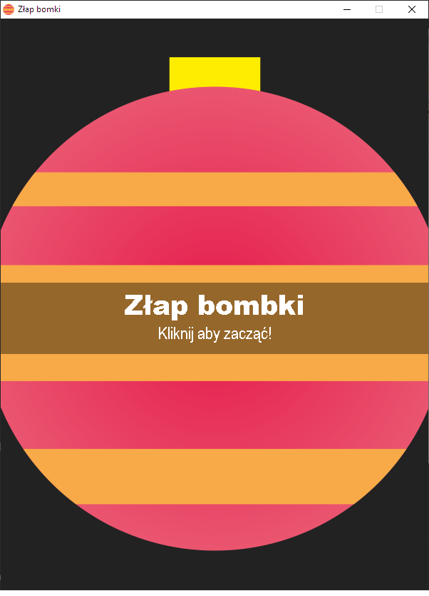
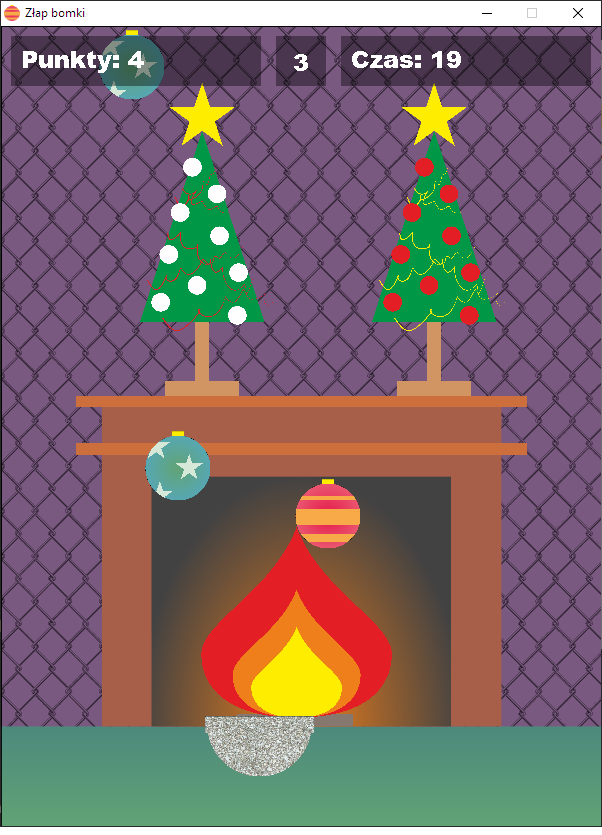
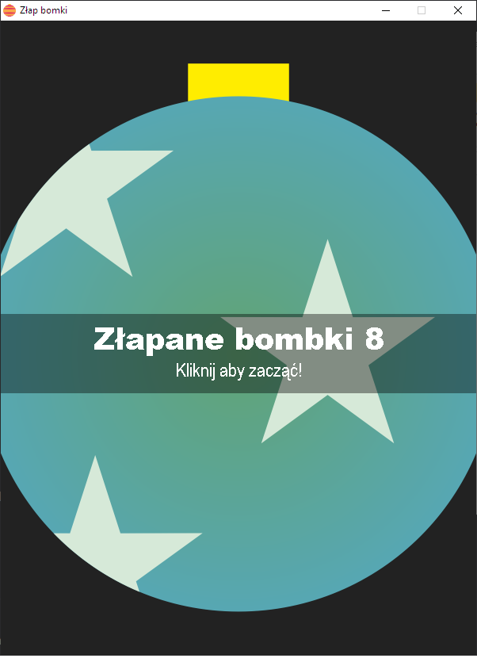

# Bombki
Prosta gra Świąteczna

## Wymagania

- Python 3.12.0 lub nowsza
- Pygame 2.5.2 lub nowsza
- PyInstaller 6.2.0 lub nowszy

## Uruchomienie
1) Skopiuj repozytorium
2) Zainstaluj bibliotekę PyGame [PyGame::GettingStarted](https://www.pygame.org/wiki/GettingStarted)
```
py -m pip install -U pygame --user
```
3) Uruchom
```
py run.py
```

## Zbudowanie aplikacji
1) Zainstaluj pakiet `PyInstaller`
```
pip install pyinstaller
```
2) Skompiluj aplikację do pliku wykonywalnego
```
py -m PyInstaller --onefile -w --noconsole --icon=Assets/Images/icon.ico  run.py
```
3) Skopiuj katalog `Assets` do katalogu `dist` po skompilowaniu
4) Uruchom aplikację plikiem wykonywalnym `run.exe` w katalogu `dist`


## Zrzuty ekranu



